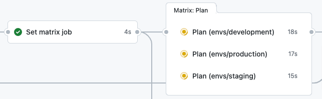
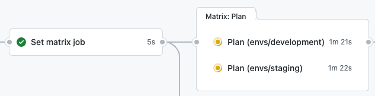

# select-target-action
Configure the matrix job directory settings using GitHub labels.

## Setup
### 1. Create configuration file
Create a json file in the following format. Specify the label name as key and target directory as value.  
The config file name or directory can be specified, but `.deploy_target.json` is used by default.

```json
{
    "target:develop": [
        "envs/development"
    ],
    "target:staging": [
        "envs/staging"
    ],
    "target:production": [
        "envs/production"
    ],
    "target:all" : [
        "envs/development",
        "envs/staging",
        "envs/production"
    ]
}
```

### 2. Create GitHub Labels
#### CUI
If the `jq` and `gh` commands are installed, the following commands are useful.
```bash
export REPO=<OWNER>/<REPO_NAME>
export COLOR=5319E7
cat .deploy_target.json | jq -r 'keys | .[]' | xargs -I @ gh label create @ --color $COLOR --repo $REPO
```

ref. https://cli.github.com/manual/gh_label_create

Example
```console
$ cat .deploy_target.json | jq -r 'keys | .[]' | xargs -I @ gh label create @ --color $COLOR --repo $REPO
✓ Label "target:all" created in ponkio-o/select-target-action
✓ Label "target:develop" created in ponkio-o/select-target-action
✓ Label "target:production" created in ponkio-o/select-target-action
✓ Label "target:staging" created in ponkio-o/select-target-action
```

#### GUI
Please refer to following doc.  
https://docs.github.com/en/issues/using-labels-and-milestones-to-track-work/managing-labels#creating-a-label

### 3. Setup Workflow
GitHub Actions are configured as follows:
```yaml
name: Terraform PR check

on:
  pull_request:
    types: [opened]
    branches:
      - main

jobs:
  select_target:
    name: Select target
    runs-on: ubuntu-latest

    outputs:
      targets: ${{ steps.sta.outputs.targets }}

    steps:
      - name: Checkout
        uses: actions/checkout@v3

      - name: Select target
        id: sta
        uses: ponkio-o/select-target-action@main

  plan:
    needs: [select_target]
    name: Plan
    runs-on: ubuntu-latest

    strategy:
      matrix:
        target: ${{fromJson(needs.select_target.outputs.targets)}}

    steps:
      - name: Checkout
        uses: actions/checkout@v3

      - name: Setup terraform
        uses: hashicorp/setup-terraform@v1

      - name: Terraform plan
        working-directory: ${{ matrix.target }}
        run: terraform plan -input=false -no-color
...
```

## Usage
The directories set in the key of the given label are merged and returned as an array.

### Deployment
Assign labels to the Pull Request. You can also select multiple labels.

#### Example: `target:all`


#### Example: `target:develop` & `target:staging`


#### Example: `target:all` & `target:staging`


### Default Target
If you have directories that you want to run by default, you can set them to the "default" key. It can be used in conjunction with other labels, and if valid labels are selected, it will take precedence.

```json
{
    "default" : [
        "envs/development",
        "envs/staging",
        "envs/production"
    ]
}
```

### Inputs
All inputs are optional.
| Name                 | Description | Default |
|----------------------|-------------|---------|
| `config_file` | Path to configuration file |`.deploy_target.json`|
| `token`       | `GITHUB_TOKEN` or [PersonalAccessToken(PAT)](https://docs.github.com/en/authentication/keeping-your-account-and-data-secure/creating-a-personal-access-token)|`GITHUB_TOKEN` |

### Outputs
The working directory outputs as an array.
|Name     |Description                                   |
|---------|----------------------------------------------|
|`targets`|The working directories are output as an array|

Example:
```bash
["envs/development","envs/staging","envs/production"]
```
