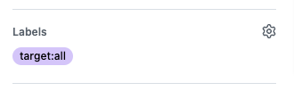
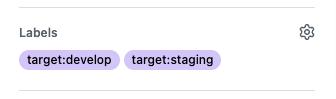

# select-target-action
Configure the matrix job directory in GitHub Label.

## Setup
### GitHub Label
For example, create the following labels.

- `target:all`
- `target:develop`
- `target:staging`
- `target:production`

https://docs.github.com/en/issues/using-labels-and-milestones-to-track-work/managing-labels#creating-a-label

### Configuration file
Create a json file in the following format. Specify the label name as key and target directory as value.  
The config file name or directory can be specified, but `.deploy_target.json` is used by default.

```json
{
    "target:develop": [
        "envs/dev"
    ],
    "target:staging": [
        "envs/stg"
    ],
    "target:production": [
        "envs/prod"
    ],
    "target:all" : [
        "envs/dev",
        "envs/stg",
        "envs/prod"
    ]
}
```

### Workflow
GitHub Actions are configured as follows:
```yaml
name: Terraform PR check

on:
  pull_request:
    types: [opened]
    branches:
      - main

jobs:
  set-matrix:
    runs-on: ubuntu-latest

    outputs:
      workdir: ${{ steps.set_matrix.outputs.matrix-workdir }}

    steps:
      - name: checkout
        uses: actions/checkout@v3

      - name: Set matrix
        id: set_matrix
        uses: ponkio-o/select-target-action@main

  plan:
    needs: [set-matrix]
    name: terraform plan
    runs-on: ubuntu-latest

    strategy:
      matrix:
        workdir: ${{fromJson(needs.set-matrix.outputs.workdir)}}

    steps:
      - name: Checkout
        uses: actions/checkout@v3

      - name: Setup terraform
        uses: hashicorp/setup-terraform@v1

      - name: Terraform plan
        working-directory: ${{ matrix.workdir }}
        run: terraform plan -input=false -no-color
...
```

## Usage
The directories set in the key of the given label are merged and returned as an array.

### Deployment
Deploy to all enviornment.


If multiple labels are selected, the values are merged.


### Inputs
All inputs are optional.
| Name                 | Description | Default |
|----------------------|-------------|---------|
| `config_file` | The json file defined the deploy target |`.deploy_target.json`|
| `token`       | `GITHUB_TOKEN` or [PersonalAccessToken(PAT)](https://docs.github.com/en/authentication/keeping-your-account-and-data-secure/creating-a-personal-access-token)|`GITHUB_TOKEN` |

### Outputs
The working directory outputs as an array.
```bash
["envs/dev","envs/stg","envs/prod"]
```
